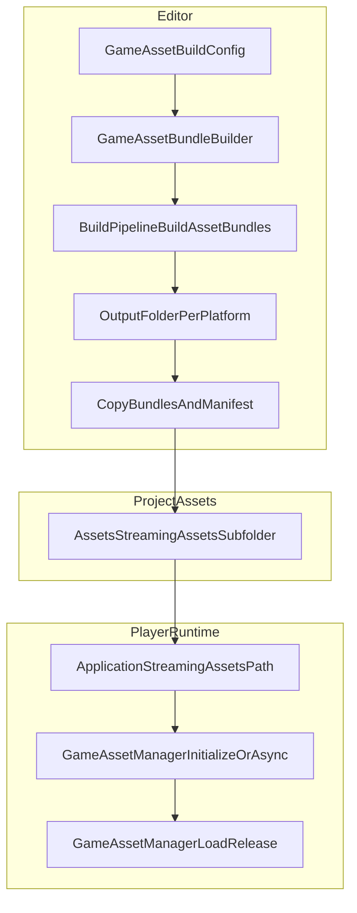

# Tactics Game Asset Pipeline

本文说明项目中基于 AssetBundle 的资源管线：如何用 `GameAssetBuildConfig` 配置与构建资源，以及运行时如何通过 **`GameAssetManager`**（场景单例）加载与释放。旧的 `GameAssets` / `GameAsset` 静态 API 仍保留为 **过时转发**，新代码请使用 Manager。

实现代码位于 [`Assets/Tactics/AssetPipeline/`](../Assets/Tactics/AssetPipeline/)。

## 概述

1. 在编辑器中根据 **构建配置**（`GameAssetBuildConfig`）调用 `BuildPipeline.BuildAssetBundles` 打出 bundle，并生成 **`manifest.json`**（资源路径 → 所属 bundle、bundle 依赖等）。
2. 构建结果会 **复制到** `Assets/StreamingAssets/{streamingSubfolder}`（默认子目录名为 `Bundles`）。
3. 玩家运行时从 `Application.streamingAssetsPath` 下读取 **`manifest.json`**，再按需加载磁盘上的 bundle 文件。

与路径相关的常量见 [`Assets/Tactics/AssetPipeline/Runtime/GameAssetPaths.cs`](../Assets/Tactics/AssetPipeline/Runtime/GameAssetPaths.cs)（默认 `StreamingBundlesFolder = "Bundles"`，`ManifestFileName = "manifest.json"`）。

## 从构建到运行时的数据流



- **中间输出**：默认根目录为项目下的 `Output/AssetBundles/`，其下再按平台名分子文件夹（由 [`BuildOutputLayout`](../Assets/Tactics/AssetPipeline/Editor/BuildOutputLayout.cs) 与构建目标决定）。Player **不会**从该路径读 bundle；打包时只有进入 **StreamingAssets** 的内容才会进玩家包体（或随包可访问路径）。
- **Editor 调试**：可在 `GameAssetManager` 上填写 **Bundles Root Override** 为中间输出的 **绝对路径**，在不必每次拷贝到 StreamingAssets 的情况下仍走 **真实 Bundle 加载**（见下文「加载模式」）。
- **真机注意**：Android / WebGL 上读取 StreamingAssets 的方式与桌面不同；运行时请优先使用 `GameAssetManager.InitializeAsync()`（见下文）。

## 构建配置：`GameAssetBuildConfig`

资源：[菜单 `Assets > Create > Tactics > Asset Pipeline > Build Config`](../Assets/Tactics/AssetPipeline/Editor/GameAssetBuildConfig.cs) 创建；项目中示例可参考 [`Assets/Tactics/AssetPipeline/GameAssetBuildConfig.asset`](../Assets/Tactics/AssetPipeline/GameAssetBuildConfig.asset)。

| 字段 | 含义 |
|------|------|
| `streamingSubfolder` | 拷贝目标在 `StreamingAssets` 下的子文件夹名；空或非法时会回退为默认 `Bundles`。 |
| `groups` | 多个 `GameAssetBundleGroup`，每个对应 **一个** AssetBundle。 |

每个 **`GameAssetBundleGroup`**：

| 字段 | 含义 |
|------|------|
| `bundleName` | Bundle 逻辑名（无扩展名），在全部 group 中 **必须唯一**。 |
| `rootFolder` | 若设为工程内 **文件夹**，则其下所有 **文件资源**（递归）在满足过滤规则时进入该 bundle。 |
| `excludeFolders` | 排除列表：匹配 **自身路径或其子路径** 的资源不会进入该 group（对 `rootFolder` 扫到的与 `extraAssetPaths` 展开到的均生效）。 |
| `extraAssetPaths` | 额外纳入的资源：可为单个 `Assets/...` 路径；或使用 glob（须以 `Assets/` 开头）：`folder/*` 仅该文件夹 **直接子文件**，`folder/**` **递归**该文件夹下文件。 |

**自动排除**（不进包）：路径任一段为 `Editor` 的文件夹、`.cs`、`.asmdef`、以及主类型为 `MonoScript` 的资源（详见 [`GameAssetBundleBuilder`](../Assets/Tactics/AssetPipeline/Editor/GameAssetBundleBuilder.cs)）。

### 硬性约束：场景与非场景不得混包

Unity 不允许 **Scene 资源（`.unity` / `SceneAsset`）** 与普通资源打在 **同一个** AssetBundle 里。构建器会校验每个 group；若混放则 **中止构建** 并在 Console 打出错误与修复建议。

**推荐做法**（与示例配置一致）：例如 `main_scenes` 只放场景；`main_assets` 放其余资源，并用 `excludeFolders` 去掉包含 `.unity` 的目录，避免被 `rootFolder` 扫入。

## 编辑器：如何构建

### 菜单（[`GameAssetPipelineMenu`](../Assets/Tactics/AssetPipeline/Editor/GameAssetPipelineMenu.cs)）

| 菜单项 | 作用 |
|--------|------|
| `Tactics > Asset Pipeline > Asset Pipeline Window` | 打开 Odin 构建窗口。 |
| `Tactics > Asset Pipeline > Build Game Asset Bundles` | 按当前选中的 `GameAssetBuildConfig` 构建；未选中则使用项目中 **第一个** `GameAssetBuildConfig`（`FindDefault()`）。 |
| `Tactics > Asset Pipeline > Clear And Build Game Asset Bundles` | 同上，但会先清空中间输出目录与 StreamingAssets 目标目录中的非 `.meta` 文件再拷贝。 |

### 构建窗口（[`GameAssetPipelineWindow`](../Assets/Tactics/AssetPipeline/Editor/GameAssetPipelineWindow.cs)）

- **Config**：使用的 `GameAssetBuildConfig`（可记忆在 EditorPrefs）。
- **Bundle build**：中间输出根路径、`bundleBuildTarget`（覆盖菜单构建时的活动平台）。
- **Streaming**：`streamingBundlesDestinationOverride` 若填写则拷贝到该绝对路径；**留空** 则为 `Assets/StreamingAssets/{config.streamingSubfolder}`。
- **Player**：输出目录、`playerBuildTarget`、`buildBundlesBeforePlayer`（打 Player 前先打 bundle）、`developmentBuild` 等。

**要点**：若要 **Player 能加载** bundle，构建完成后内容必须在 **StreamingAssets**（或你覆盖的等价目标）中；`Output/...` 仅作中间产物（除非在 Editor 下用 Manager 的 **Bundles Root Override** 指向该目录做验证）。

### 示例场景（可选）

- 菜单 `Tactics > Asset Pipeline > Setup Sample (Prefab + Build Config)`：准备 Sample 预制体与配置（[`GameAssetSampleSetup`](../Assets/Tactics/AssetPipeline/Editor/GameAssetSampleSetup.cs)）。
- 组件 [`BundleLoadSmokeTest`](../Assets/Tactics/AssetPipeline/Runtime/BundleLoadSmokeTest.cs)：场景中需有 [`GameAssetManager`](../Assets/Tactics/AssetPipeline/GameAssetManager.prefab) 预制体实例；进 Play 前打好 bundle，用于快速验证加载链路。

## 运行时：资源管理

程序集：**`Tactics.AssetPipeline`**，命名空间 **`Tactics.AssetPipeline`**。

### `GameAssetManager`（场景单例：代码引导与预制体）

- **与当前实现一致的引导 API**（见 [`GameAssetManager.cs`](../Assets/Tactics/AssetPipeline/Runtime/GameAssetManager.cs)）：
  - **`CreateBootstrap(GameAssetRuntimeSettings settings)`**：`settings == null` 时返回 `null`。否则顺序为：`new GameObject("GameAssetManager")` → `SetActive(false)` → `AddComponent<GameAssetManager>()` → **`ApplyRuntimeSettings(settings)`** → `SetActive(true)`。在未激活物体上添加组件时，Unity 会推迟 **`Awake`** 到激活之后，因此能在激活前写完 SO 配置，与「未激活预制体 `Instantiate` → `ApplyRuntimeSettings` → 激活」**顺序等价**。
  - **`ApplyRuntimeSettings(settings)`**：`settings == null` 时 **无操作**。否则将 [`GameAssetRuntimeSettings`](../Assets/Tactics/AssetPipeline/Runtime/GameAssetRuntimeSettings.cs) 中的 **`loadMode`**、**`bundlesRootOverride`**、**`autoInitializeOnAwake`**、**`persistAcrossScenes`** 写入 Manager（持久化跨场景通过内部的 `SetPersistAcrossScenes`，宜在 **`Awake` 之前** 调用，以便单例注册时应用 `DontDestroyOnLoad`）。
  - 只读 **`SerializedLoadMode`**：反映序列化/应用 SO 后的 **`GameAssetLoadMode`**（与运行时 `EffectiveLoadMode` 不同：Player 下若误配 `EditorAssetDatabase` 会回退为 `StreamingBundles` 并打警告）。
- 预制体：[`Assets/Tactics/AssetPipeline/GameAssetManager.prefab`](../Assets/Tactics/AssetPipeline/GameAssetManager.prefab)。作为 **非 Splash 场景** 或工具链中的 **可选模板** 时，若要在 `Instantiate` 之后、激活之前调用 `ApplyRuntimeSettings`，**根物体应保持未激活**（`m_IsActive: 0`）；否则 `Awake`（含可选的 **`Initialize()`**）会在应用 SO 之前运行。Splash 引导 **不依赖** 该预制体。
- **Splash / 引导**：[`GameMain`](../Assets/Tactics/Scripts/GameMain.cs) 引用 **`GameAssetRuntimeSettings`**（未赋值会打 Error 并中止）；在 `Instance == null` 时调用 **`CreateBootstrap`**，再 **`InitializeAsync`**（若 SO 关闭 **`autoInitializeOnAwake`** 则必须由引导代码初始化）并加载首场景。菜单：`Assets > Create > Tactics > Asset Pipeline > Runtime Settings`。
- **其它入口场景**（单独 Play 的测试场景等）：仍可在场景中直接放一个 **已激活** 的 Manager 实例，或使用上述预制体；**禁止**重复第二个实例。重复时 `Awake` 会销毁多余物体并打警告。
- 继承 [`MonoBehaviourSingleton<GameAssetManager>`](../Assets/Tactics/AssetPipeline/Runtime/MonoBehaviourSingleton.cs)：可通过 **`Persist Across Scenes`**（或 Runtime Settings 中的同名字段）配合 `DontDestroyOnLoad` 跨场景保留。

### Inspector 配置

| 字段 | 含义 |
|------|------|
| **Load Mode** | `StreamingBundles`：从磁盘加载 AssetBundle（与 Player 一致）。`EditorAssetDatabase`：**仅 Editor Play Mode**：Prefab 等用 `AssetDatabase.LoadAssetAtPath`；**场景**用 `EditorSceneManager.LoadSceneInPlayMode`；**不读取** `manifest.json`，路径以工程内 `AssetDatabase` 是否存在为准（`ResolveBundleForAsset` / `GetLoadOrder` 在此模式下不可用）。Player 构建中若误选该模式会自动回退为 `StreamingBundles` 并打警告。 |
| **Bundles Root Override** | 留空则使用 `Application.streamingAssetsPath/Bundles`（或配置子目录约定下的 manifest 所在目录）。填写 **绝对路径** 时，manifest 与 bundle 文件均从该目录读取（常用于 Editor 下直接指向 `Output/AssetBundles/<Platform>`）。 |
| **Auto Initialize On Awake** | 若为真，`Awake` 中调用同步 `Initialize()`；关闭则需自行调用 `Initialize()` / `InitializeAsync()`。 |

### 初始化

在调用 `Load` / `LoadAsync` 前须完成初始化（除非已勾选自动初始化且成功）：

- **`GameAssetManager.Initialize()`**：在 **Editor** 且 **Load Mode = EditorAssetDatabase** 时**不读** manifest，仅完成初始化；否则 `File` 读取 manifest。Standalone 等缺少 `manifest.json` 会失败并打 Error。
- **`GameAssetManager.InitializeAsync()`**：推荐在 **Android / WebGL 真机** 使用；在受限平台上通过 `UnityWebRequest` 读取 manifest（行为见 [`GameAssetManager`](../Assets/Tactics/AssetPipeline/Runtime/GameAssetManager.cs) 内平台条件编译）。Editor + `EditorAssetDatabase` 时与同步初始化同逻辑，不读 manifest。

### 按工程路径加载与释放

使用与编辑器一致的 **工程资源路径**（如 `Assets/...`）。在 **`StreamingBundles`** 下，该路径必须出现在 **manifest** 的 `assets` 列表中。
在 **`EditorAssetDatabase`**（仅 Editor）下，路径须在工程中真实存在（`AssetDatabase` 校验），**不必**进 manifest。

路径会经 `GameAssetManager.NormalizeAssetPath` 处理（统一 `/` 等），建议调用方也使用 `Assets/...` 正斜杠形式。

```csharp
using Tactics.AssetPipeline;
using UnityEngine;

public sealed class ExampleBootstrap : MonoBehaviour
{
    private const string PrefabPath = "Assets/MyFolder/MyPrefab.prefab";

    private async void Start()
    {
        var mgr = GameAssetManager.Instance;
        if (mgr == null || (!mgr.IsInitialized && !await mgr.InitializeAsync()))
            return;

        try
        {
            var prefab = await mgr.LoadAsync<GameObject>(PrefabPath);
            Instantiate(prefab);
            mgr.Release(PrefabPath);
        }
        catch (System.Exception e)
        {
            Debug.LogException(e);
        }
    }
}
```

**引用计数（StreamingBundles 模式）**：每次 `Load` / `LoadAsync` 会对目标资源所在 bundle 及其 **依赖链** 增加引用；`Release(assetProjectPath)` 对 **同一路径** 调用一次，会按与加载相反的顺序减少引用，计数归零时对 bundle 执行 `Unload(false)`。请保持 **每次成功加载与 `Release` 配对**。

**EditorAssetDatabase 模式**：不加载 AssetBundle；`Load` / `LoadAsync` 通过 `AssetDatabase` 取资源，`Release` 仅维护 **按路径的引用计数**（不卸载工程内资产），用于与 Bundle 模式保持「成对调用」习惯。

### 场景加载（与 prefab 同入口）

- 使用 manifest 中的 **`Assets/.../Foo.unity`** 路径；**不要**对场景路径调用 `Load<GameObject>` / `LoadAsync`（会抛异常，应使用下方 API）。
- **`LoadScene` / `LoadSceneAsync`**：`LoadSceneMode` 默认为 `Single`；与 prefab 一样，每次成功加载需与 **`Release(同一路径)`** 配对，以对 bundle（或 Editor 下的路径计数）减引用。
- **`StreamingBundles`**：先对场景路径执行与资源相同的 **bundle 依赖加载**，再 `SceneManager.LoadScene` / `LoadSceneAsync`。Unity 使用 **场景名**（通常为 **文件名无扩展名**）。**不同文件夹下两个同名 `.unity` 会歧义**，建议关卡场景名在工程中全局唯一（与构建器「场景单独成包」策略一致）。
- **`EditorAssetDatabase`**：仅在 **Play Mode** 下有效，内部为 `EditorSceneManager.LoadSceneInPlayMode`；同样先校验 manifest。
- **`UnloadSceneAsync(sceneProjectPath)`**（Additive 常用）：按场景名查找已加载场景，`UnloadSceneAsync` 完成后调用 **`Release`**。若场景当前未加载，会打警告且 **不会** 调用 `Release`（避免误减引用）。

```csharp
using Tactics.AssetPipeline;
using UnityEngine;
using UnityEngine.SceneManagement;

private const string LevelPath = "Assets/Tactics/Scenes/MyLevel.unity";

private async System.Threading.Tasks.Task LoadLevelAdditiveExample()
{
    var mgr = GameAssetManager.Instance;
    if (mgr == null || !mgr.IsInitialized)
        return;

    await mgr.LoadSceneAsync(LevelPath, LoadSceneMode.Additive);
    // ... 关卡结束或卸关时：
    await mgr.UnloadSceneAsync(LevelPath);
}
```

若 `GameAssetManager` 挂在首场景并勾选 **Persist Across Scenes**，`LoadScene(Single)` 切换场景后 Manager 仍会保留。

**常见异常**：

- 场景中无 Manager 或 `Instance` 为 null：`InvalidOperationException`。
- 未初始化就加载：`InvalidOperationException`。
- 路径不在 manifest：`KeyNotFoundException`。
- 加载结果为 null：`InvalidOperationException`。

### 进阶 API

- `GameAssetManager.CreateBootstrap(settings)` / `ApplyRuntimeSettings(settings)`：运行时从 SO 创建单例并保证 **`Awake` 前** 应用配置（见上文「场景单例」）。
- `GameAssetManager.IsSceneProjectPath(path)` / `GetSceneNameForLoad(normalizedPath)`：判断 `.unity` 与得到 `SceneManager` 使用的场景名。
- `GameAssetManager.ResolveBundleForAsset(path)`：查询某工程路径落在哪个 bundle。
- `GameAssetManager.GetLoadOrder(bundleName)`：返回依赖优先的加载顺序列表（含自身），与 [`BundleCache`](../Assets/Tactics/AssetPipeline/Runtime/BundleCache.cs) 内部加载顺序一致，可用于调试或自定义扩展。

### 场景作用域管理：`AssetScopeManager`

[`AssetScopeManager`](../Assets/Tactics/AssetPipeline/Runtime/AssetScopeManager.cs) 自动管理场景卸载时的 bundle 释放时机：

- **用户代码无需调用 `RegisterLoadedPath`**：该方法由 `GameAssetManager.Load/LoadAsync` **内部** 调用，用户只需在场景边界调用 `BeginScene`。
- **`BeginScene(sceneProjectPath)`**：标记场景作用域入口（如进入新关卡时）。当该场景卸载时，已注册的路径对应的 bundle 引用会被延迟释放（等待帧末安全时机）。
- **自动创建**：`GetOrCreateInstance()` 会在无实例时创建一个隐藏的 `[AssetScopeManager]` GameObject，确保资产追踪始终生效。
- **推荐用法**：在场景加载完成后、UI/实体创建前调用 `AssetScopeManager.BeginScene(sceneProjectPath)` 建立作用域边界。

```csharp
using Tactics.AssetPipeline;

private const string LevelPath = "Assets/Tactics/Scenes/MyLevel.unity";

public async System.Threading.Tasks.Task EnterLevelAsync()
{
    AssetScopeManager.BeginScene(LevelPath);
    var mgr = GameAssetManager.Instance;
    await mgr.LoadSceneAsync(LevelPath, UnityEngine.SceneManagement.LoadSceneMode.Additive);
}
```

### 旧静态 API（过时）

`GameAssets` / `GameAsset` 上的方法已标 `[Obsolete]`，内部转发到 `GameAssetManager.Instance`。新代码请直接使用 Manager；迁移完成后可删除转发类。

## 禁止：不得使用 `Resources.Load`

**严禁** 使用 `Resources.Load` 系列方法加载项目资源。所有资源必须通过 `GameAssetManager.Load/LoadAsync` 加载（通过 AssetBundle 管线）。

违反示例（[`RoguelikeMapUIController.cs:165`](../Assets/Tactics/Runtime/UI/RoguelikeMapUIController.cs)）：

```csharp
// ❌ 禁止：使用 Resources.Load 加载资源
Sprite bgSprite = Resources.Load<Sprite>("Arts/Sprites/Kenney RPG Pack panels/panel_beige");
```

正确做法：

```csharp
// ✅ 正确：通过 GameAssetManager 加载（同步或异步）
var bgSprite = await GameAssetManager.Instance.LoadAsync<Sprite>(prefabPath);
```

**注意**：`Resources` 文件夹路径不带 `Assets/` 前缀，而 AssetBundle 管线使用工程路径格式，二者不能混用。

## 清单 `manifest.json` 格式

由构建器写入，运行时反序列化为 [`GameAssetManifest`](../Assets/Tactics/AssetPipeline/Runtime/GameAssetManifest.cs)（`JsonUtility`）：

- **`bundles`**：每个 bundle 的 `name`、磁盘上的 `file` 名、`hash`、`size`、**`deps`**（依赖的其他 bundle 名，来自 Unity 构建 manifest 且已过滤为配置内 bundle）。
- **`assets`**：每条为工程内 `path` 与所属 `bundle` 名。

运行时 `GetLoadOrder` 会按 `deps` **先加载依赖、再加载当前 bundle**，保证 `LoadAsset` 时依赖已就绪。

---

## 相关源文件索引

| 用途 | 路径 |
|------|------|
| 构建配置 | `Assets/Tactics/AssetPipeline/Editor/GameAssetBuildConfig.cs` |
| 打 AB 与写 manifest、拷贝 | `Assets/Tactics/AssetPipeline/Editor/GameAssetBundleBuilder.cs` |
| 菜单与窗口 | `Assets/Tactics/AssetPipeline/Editor/GameAssetPipelineMenu.cs`、`GameAssetPipelineWindow.cs` |
| 默认输出路径 | `Assets/Tactics/AssetPipeline/Editor/BuildOutputLayout.cs` |
| 场景单例、`CreateBootstrap` / `ApplyRuntimeSettings`、加载模式 | `Assets/Tactics/AssetPipeline/Runtime/GameAssetManager.cs` |
| 运行时共享配置（SO） | `Assets/Tactics/AssetPipeline/Runtime/GameAssetRuntimeSettings.cs`、`GameAssetRuntimeSettings.asset` |
| Splash 引导（`CreateBootstrap` + Runtime Settings） | `Assets/Tactics/Scripts/GameMain.cs` |
| 场景路径解析 / 经 Manager 加载场景 | `Assets/Tactics/AssetPipeline/Runtime/SceneProjectPathHelper.cs` |
| MonoBehaviour 单例基类 | `Assets/Tactics/AssetPipeline/Runtime/MonoBehaviourSingleton.cs` |
| Manager 预制体 | `Assets/Tactics/AssetPipeline/GameAssetManager.prefab` |
| Bundle 缓存 | `Assets/Tactics/AssetPipeline/Runtime/BundleCache.cs` |
| 过时静态转发 | `Assets/Tactics/AssetPipeline/Runtime/GameAssets.cs`、`GameAsset.cs` |
| Manifest 数据结构 | `Assets/Tactics/AssetPipeline/Runtime/GameAssetManifest.cs` |
