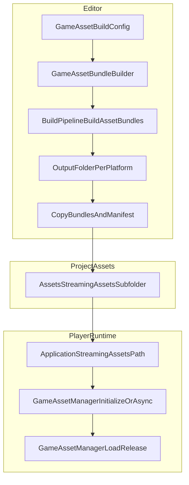

# game-asset-pipeline

> **运行时加载**请查阅 `unity-asset-workflow` skill。
> 本文仅覆盖构建端：配置 Bundle、构建管线、平台差异。

## Quick Reference

| Operation | Key API / File |
|-----------|---------------|
| Create build config | `Assets > Create > Tactics > Asset Pipeline > Build Config` |
| Build bundles | `GameAssetBundleBuilder` via menu or code |

## Overview

1. In the editor, use a build config (`GameAssetBuildConfig`) to call `BuildPipeline.BuildAssetBundles` and generate `manifest.json` (mapping resource paths to bundles and bundle dependencies).
2. Build results are copied to `Assets/StreamingAssets/{streamingSubfolder}` (default subfolder is `Bundles`).
3. At runtime, the player reads `manifest.json` from `Application.streamingAssetsPath`, then loads bundle files from disk as needed.

Path constants are in `Assets/Tactics/Scripts/AssetPipeline/Runtime/GameAssetPaths.cs` (default `StreamingBundlesFolder = "Bundles"`, `ManifestFileName = "manifest.json"`).

The full source lives at `Assets/Tactics/Scripts/AssetPipeline/`.

## When to use

- 配置或创建 `GameAssetBuildConfig` 时
- 构建、清理、验证 AssetBundle 和 `manifest.json` 时
- 调试 `GameAssetManager` 的 Bundle 模式加载时
- 排查平台相关的 StreamingAssets 或 Bundle 输出问题时

## Data Flow

- **Intermediate output**: Root directory is `Output/AssetBundles/` under the project, with platform-specific subfolders (determined by `BuildOutputLayout` and build target). The player does NOT read bundles from this path; only content in **StreamingAssets** enters the player package.
- **Editor debugging**: Set **Bundles Root Override** on `GameAssetManager` to the intermediate output's **absolute path** to load real bundles without copying to StreamingAssets each time.
- **Platform note**: Android/WebGL read StreamingAssets differently from desktop; prefer `GameAssetManager.InitializeAsync()` at runtime.

## Workflow

### Configuring AssetBundles

#### Step 1: Create Build Config

Create a `GameAssetBuildConfig` asset via `Assets > Create > Tactics > Asset Pipeline > Build Config`. A sample config is at `Assets/Tactics/Scripts/AssetPipeline/GameAssetBuildConfig.asset`.

| Field | Description |
|-------|-------------|
| `streamingSubfolder` | Target subfolder name under `StreamingAssets`; falls back to `Bundles` if empty or invalid. |
| `groups` | Multiple `GameAssetBundleGroup` entries, each corresponding to **one** AssetBundle. |

#### Step 2: Define Bundle Groups

Each `GameAssetBundleGroup`:

| Field | Description |
|-------|-------------|
| `bundleName` | Logical bundle name (no extension), **must be unique** across all groups. |
| `rootFolder` | A project **folder** whose contents (recursive) enter this bundle if they satisfy filter rules. |
| `excludeFolders` | Exclusion list: resources whose own path or subpath matches are excluded (applies to both `rootFolder` scans and `extraAssetPaths` expansions). |
| `extraAssetPaths` | Additional resources: single `Assets/...` path, or glob patterns starting with `Assets/`: `folder/*` for immediate children, `folder/**` for recursive children. |

**Auto-excluded** (never bundled): folders with `Editor` anywhere in their path, `.cs` files, `.asmdef` files, and resources whose main type is `MonoScript`.

**Scene vs non-scene separation**: Unity does not allow Scene resources (`.unity` / `SceneAsset`) and regular assets in the same AssetBundle. The builder validates each group and **aborts** on mixed bundles with an error and fix suggestion.

Recommended practice: use a `main_scenes` group for scenes only and a `main_assets` group for other resources, with `excludeFolders` to exclude directories containing `.unity` files from the assets group.

#### Step 3: Build Bundles

**Menu** (via `GameAssetPipelineMenu`):

| Menu Item | Description |
|-----------|-------------|
| `Tactics > Asset Pipeline > Asset Pipeline Window` | Open the Odin build window. |
| `Tactics > Asset Pipeline > Build Game Asset Bundles` | Build using the currently selected `GameAssetBuildConfig`, or the **first** config found (`FindDefault()`). |
| `Tactics > Asset Pipeline > Clear And Build Game Asset Bundles` | Same as above, but clears intermediate output and StreamingAssets target (non-`.meta` files) before copying. |

**Build Window** (`GameAssetPipelineWindow`):

- **Config**: The `GameAssetBuildConfig` to use (persisted in EditorPrefs).
- **Bundle build**: Intermediate output root path, `bundleBuildTarget` (overrides active platform for menu builds).
- **Streaming**: `streamingBundlesDestinationOverride` — if set, copies to that absolute path; if **empty**, uses `Assets/StreamingAssets/{config.streamingSubfolder}`.
- **Player**: Output directory, `playerBuildTarget`, `buildBundlesBeforePlayer` (build bundles before building player), `developmentBuild`, etc.

**Key point**: For the player to load bundles, output must be in **StreamingAssets** (or an overridden equivalent). `Output/...` is intermediate (unless using Bundles Root Override in the Editor).

**Sample setup** (optional):
- `Tactics > Asset Pipeline > Setup Sample (Prefab + Build Config)`: prepares a sample prefab and config (`GameAssetSampleSetup`).
- `BundleLoadSmokeTest` component: place the `GameAssetManager` prefab in the scene, build bundles, then enter Play Mode to verify the loading pipeline.

#### Step 4: Verify Manifest

The builder writes `manifest.json`, deserialized at runtime as `GameAssetManifest` (via `JsonUtility`):

- **`bundles`**: each entry has `name`, disk `file`, `hash`, `size`, and **`deps`** (other bundles this one depends on, filtered to config-contained bundles).
- **`assets`**: each entry is a project `path` mapped to its `bundle` name.

At runtime, `GetLoadOrder` uses `deps` to **load dependencies first, then the current bundle**, ensuring assets are ready when needed.

## Editor Debugging

- Set **Bundles Root Override** on `GameAssetManager` to an absolute path (e.g., `Output/AssetBundles/StandaloneWindows64`) for real bundle loading without copying to StreamingAssets.
- Use `EditorAssetDatabase` Load Mode for rapid iteration (skips bundle build entirely).
- Use `BundleLoadSmokeTest` component on the Manager prefab in a test scene to quickly verify the loading pipeline after building bundles.

## Platform Notes

- **Android**: StreamingAssets are compressed inside APK. Use `UnityWebRequest` — always prefer `InitializeAsync()`.
- **WebGL**: Similar to Android. Use `UnityWebRequest` — always prefer `InitializeAsync()`.
- **Standalone**: `File.ReadAllText` works for manifest; sync `Initialize()` is safe.

## Reference Files

| Purpose | Path |
|---------|------|
| Build config | `Assets/Tactics/Scripts/AssetPipeline/Editor/GameAssetBuildConfig.cs` |
| Build bundles and manifest | `Assets/Tactics/Scripts/AssetPipeline/Editor/GameAssetBundleBuilder.cs` |
| Menu and window | `Assets/Tactics/Scripts/AssetPipeline/Editor/GameAssetPipelineMenu.cs`, `GameAssetPipelineWindow.cs` |
| Default output path | `Assets/Tactics/Scripts/AssetPipeline/Editor/BuildOutputLayout.cs` |
| Scene singleton, load modes | `Assets/Tactics/Scripts/AssetPipeline/Runtime/GameAssetManager.cs` |
| Runtime shared config (SO) | `Assets/Tactics/Scripts/AssetPipeline/Runtime/GameAssetRuntimeSettings.cs`, `Assets/Tactics/Scripts/AssetPipeline/GameAssetRuntimeSettings.asset` |
| Splash bootstrap | `Assets/Tactics/Scripts/GameMain.cs` |
| Scene path resolution | `Assets/Tactics/Scripts/AssetPipeline/Runtime/SceneProjectPathHelper.cs` |
| MonoBehaviour singleton base | `Assets/Tactics/Scripts/AssetPipeline/Runtime/MonoBehaviourSingleton.cs` |
| Manager prefab | `Assets/Tactics/Scripts/AssetPipeline/GameAssetManager.prefab` |
| Bundle cache | `Assets/Tactics/Scripts/AssetPipeline/Runtime/BundleCache.cs` |
| Obsolete forwarding | `Assets/Tactics/Scripts/AssetPipeline/Runtime/GameAssets.cs`, `GameAsset.cs` |
| Manifest data structure | `Assets/Tactics/Scripts/AssetPipeline/Runtime/GameAssetManifest.cs` |

## Anti-patterns

| Wrong | Correct | Why |
|-------|---------|-----|
| Mixing scenes and non-scene assets in one bundle | Split into scene and asset groups | Unity rejects mixed SceneAsset bundles |
| Reading bundles from `Output/AssetBundles` in player builds | Copy to `Assets/StreamingAssets/<subfolder>` | Only StreamingAssets is packaged |
| Using sync initialization on Android/WebGL | Prefer `InitializeAsync()` | StreamingAssets may require UnityWebRequest |
| Documenting outdated AssetPipeline paths | Use `Assets/Tactics/Scripts/AssetPipeline` | Matches current repository layout |

## Checklist

- [ ] Bundle groups have unique names
- [ ] Scene assets and non-scene assets are in separate groups
- [ ] Editor-only folders and scripts are excluded
- [ ] Build output is copied to StreamingAssets or a deliberate override
- [ ] Runtime verification uses `GameAssetManager.InitializeAsync()` where platform-safe
