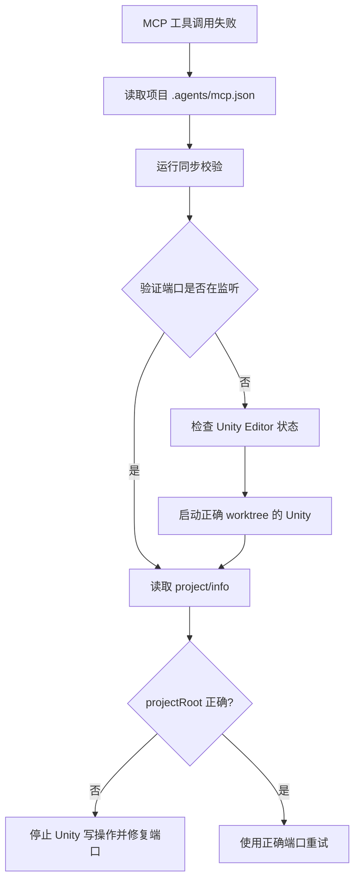

# unity-mcp-core

## Quick Reference

| 规则 | 说明 |
|------|------|
| 禁止直接读写 YAML | 不碰 .asset/.prefab/.unity/.mat/.meta 文件 |
| 必须使用 MCP 工具 | `manage_asset`, `manage_gameobject`, `manage_components` 等 |
| 保护用户焦点 | 默认禁止 Computer Use、窗口激活和真实输入；后台不足时停止人工 QA |
| Open/Close 配对 | 打开 Prefab/Scene → 保存 → 关闭 |
| 批量操作用 batch | `batch_execute` 减少延迟 |
| 先搜索再操作 | `find_gameobjects` → `manage_*` |

**子技能索引**：
| 领域 | 加载技能 |
|------|---------|
| GameObject + Component | `unity-mcp-gameobjects` |
| Scene + Prefab + Camera | `unity-mcp-scene` |
| Asset + Material + Texture | `unity-mcp-assets` |
| Script + Build + Profiler + Debug | `unity-mcp-advanced` |

---

## When to use

- 需要通过 MCP 操作 Unity Editor、场景、Prefab、材质、脚本或构建时
- 不确定应该使用哪个 Unity MCP 子技能时
- 需要确认 Unity YAML、Prefab Stage、Scene 加载和批量操作的安全规则时
- 需要在 Codex 或 OpenCode 中保持一致的 Unity Editor 操作流程时

## Workflow

1. 首次 Unity MCP 调用前，先读取本 worktree 的 `.agents/mcp.json`，并运行 `powershell.exe -File Tools/unity-mcp/Sync-ProjectMcpConfig.ps1 --check`。
2. 用该 URL 的 `mcpforunity://project/info` 验证 `projectRoot` 是当前 worktree；根目录不匹配时，禁止后续 Unity 写操作。
3. 按[前台交互与焦点保护规则](../../rules/foreground-interaction.md)确认任务能用后台 MCP、测试或虚拟输入完成；普通视觉 QA 不授权前台窗口控制。
4. 再判断目标是否是 Unity 序列化资产或 Editor 状态。
5. 加载本技能确认核心规则，再按领域加载子技能。
6. 用搜索/读取工具定位目标对象，不直接读写 Unity YAML。
7. 对 3 个以上独立操作使用 `batch_execute`。
8. 对打开的 Prefab 或 Scene 执行保存/关闭配对。

## Core Rules

### Foundational Principles

1. **NEVER** directly read or edit YAML text content of `.asset`, `.prefab`, `.unity`, `.mat`, `.anim`, `.controller`, `.meta`, or any other Unity-serialized files。
2. **NEVER** use `ReadFile`, `WriteFile`, `StrReplaceFile`, `Glob`, or `Grep` tools on `.asset`, `.prefab`, `.unity`, `.mat`, `.anim`, `.controller`, `.meta` files。
3. **NEVER** manipulate `ProjectSettings/` directory files directly。
4. **ALWAYS** use MCP tools for asset inspection and operations (`manage_asset`, `manage_gameobject`, `manage_components`, etc.)。
5. **ALWAYS** pair open/close operations (open prefab stage → close prefab stage, load scene → close/unload scene)。
6. **NEVER** assume tools exist — verify MCP server is configured via `debug_request_context` if needed。
7. **NEVER** use Computer Use, `activate_window`, physical mouse/keyboard input, or shortcuts for Unity work unless the current task passes the explicit-request and action-time-confirmation gate in the foreground interaction policy。

### Foreground Interaction Boundary

- Unity screenshots use `manage_camera`; compilation, tests and builds use MCP tools; interaction coverage uses PlayMode tests and Input System virtual devices.
- Needing a representative Game View state, clicking a skill, entering Play Mode, or recovering a disconnected bridge does not justify controlling the real Editor window.
- If the required evidence cannot be obtained in the background, stop with `manual_visual_qa_pending` and give the user the smallest manual verification step.
- The single exception path is defined by the [foreground interaction policy](../../rules/foreground-interaction.md); do not invent broader exceptions in child skills.

### Open/Close Pairing

| Operation | Open | Close / Save |
|-----------|------|--------------|
| Prefab | `manage_prefabs` (open_prefab_stage) | `manage_prefabs` (save_prefab_stage → close_prefab_stage) |
| Scene | `manage_scene` (load) | `manage_scene` (save → close_scene) |

Always save before closing。 Leaving prefab edit mode or scene without saving discards changes。

### Tool Priority

- Use **specialized** tools over generic ones (e.g., `manage_asset` over raw file access)。
- Use `manage_asset` (search) first to locate assets, then `manage_asset` (get_info) for details。
- Use `find_gameobjects` to locate GameObjects in scenes or opened prefabs。
- Use `batch_execute` for multiple independent operations to reduce latency。

### Batch Execution

```json
{
  "commands": [
    {"tool": "manage_gameobject", "params": {"action": "create", "name": "Obj1", "primitive_type": "Cube"}},
    {"tool": "manage_gameobject", "params": {"action": "create", "name": "Obj2", "primitive_type": "Sphere"}}
  ]
}
```

Use `batch_execute` when performing 3+ independent operations。 Reduces latency and token costs by 10-100x compared to sequential calls。

## Connection Troubleshooting

当 MCP 工具调用失败（如 "Session not found"、"Connection refused"、"Connection timeout"）时：

### 必须执行的步骤

1. **首先**读取本 worktree 的 `.agents/mcp.json`；它是忽略的本地 URL 真相源，不应被 Git 跟踪。
2. 运行 `powershell.exe -File Tools/unity-mcp/Sync-ProjectMcpConfig.ps1 --check`，确认 Codex/OpenCode 客户端配置与项目 URL 一致。
3. 调用 `mcpforunity://project/info`，确认返回的 `projectRoot` 是当前 worktree。若不一致，停止所有 Unity 写操作，修复端口或启动正确的 Unity Editor 后再试。

4. **不要**假设默认端口（3000、8080、5000 等）

5. **使用**项目 JSON 中的实际端口进行连接测试

6. **确认**Unity Editor 是否已启动，MCP 插件是否已启用

### 故障排除流程



### Anti-patterns

| ❌ 错误 | ✅ 正确 | 原因 |
|---------|---------|------|
| 假设端口 3000 | 读取配置文件确认端口 | 配置可能不同 |
| 重复尝试相同错误端口 | 改变策略，检查配置 | 避免无效重复 |
| 不检查 Unity 状态 | 确认 Unity Editor 已启动 | MCP 需要 Unity 运行 |
| 忽略配置文件 | 首先读取配置 | 配置是唯一真相源 |

## Anti-patterns

| Wrong | Correct | Why |
|-------|---------|-----|
| Editing `.prefab` text directly | Use `manage_prefabs` or asset MCP tools | Preserves Unity serialization |
| Loading a scene and leaving it open | Save and close/unload it | Avoids hidden editor state |
| Repeating many single MCP calls | Use `batch_execute` | Reduces latency and token cost |
| Assuming a tool exists | Verify available MCP tools or context | Prevents dead-end tool calls |
| 向未知 `projectRoot` 写资产 | 先检查 `project/info`，不匹配即停止 | 防止写入其他 worktree |
| 将本地 `mcp.json` 提交到 Git | 仅提交模板和工具 | 防止 merge/rebase 覆盖 worktree 端口 |
| 为视觉 QA 激活 Unity 或点击真实 Game View | 使用 MCP 截图、PlayMode 虚拟输入；不足时标记人工 QA | 避免抢占用户正在进行的前台工作 |

## Checklist

- [ ] No Unity YAML file was read or edited directly
- [ ] Correct domain child skill was loaded when needed
- [ ] Targets were searched/read before mutation
- [ ] Open prefab/scene operations have save and close steps
- [ ] Batch operations use `batch_execute` when appropriate
- [ ] 已用 `.agents/mcp.json` 和 `project/info` 校验当前 worktree
- [ ] 未使用 Computer Use、窗口激活或真实输入控制 Unity；后台不足时已标记 `manual_visual_qa_pending`
