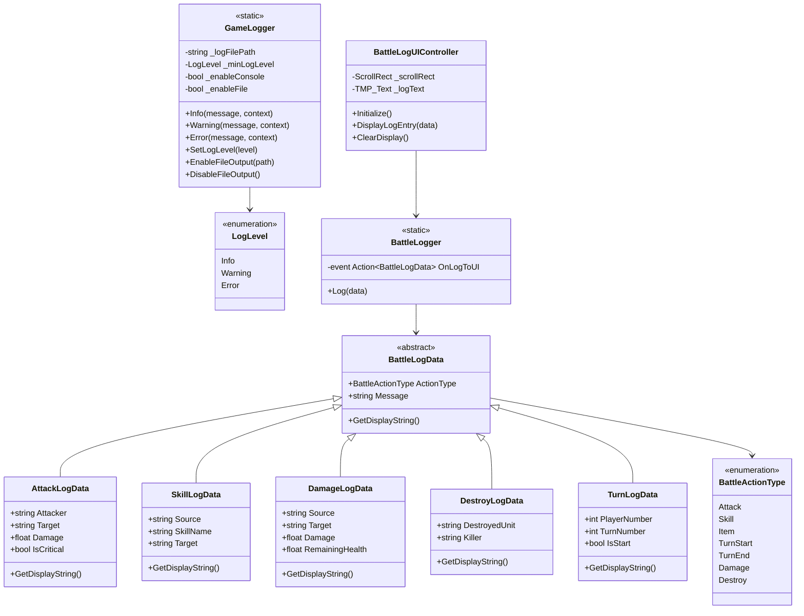

# 战斗日志系统设计文档

## 概述

本文档描述了一个分层日志系统的设计：
1. **GameLogger** - 静态通用日志类，替代 Unity 原生 Debug.Log，支持 Console 和文件输出
2. **BattleLogger** - 静态战斗日志类，基于 GameLogger，使用派生的 BattleLogData 子类

**设计原则：**
- 静态类：无状态设计，使用更方便
- 统一接口：所有战斗日志使用 `Log(BattleLogData data)` 接口
- 派生数据类：通过不同的 BattleLogData 子类区分日志类型
- 日志输出使用英文，设计文档使用中文

---

## 系统架构



---

## 核心组件

### 1. GameLogger（静态通用日志类）

**位置：** `Assets/Tactics/Scripts/Runtime/Utilities/GameLogger.cs`

静态通用日志类，替代 Unity 原生 Debug.Log。

**日志级别（3 级）：**
| 级别 | 说明 | 颜色 |
|------|------|------|
| Info | 普通信息 | 白色 |
| Warning | 警告 | 黄色 |
| Error | 错误 | 红色 |

**使用示例：**
```csharp
// 静态类 - 无需 Instance
GameLogger.Info("Game started");
GameLogger.Warning("Resource loading is slow");
GameLogger.Error("Null reference exception", this);
```

### 2. BattleLogger（静态战斗日志类）

**位置：** `Assets/Tactics/Scripts/Runtime/BattleLog/BattleLogger.cs`

静态战斗日志类，使用统一的 Log 接口。

**统一 Log 接口：**
```csharp
public static void Log(BattleLogData data);
```

**使用示例：**
```csharp
// 使用派生的数据类
BattleLogger.Log(new AttackLogData
{
    Attacker = "Infantry A",
    Target = "Infantry B",
    Damage = 15,
    IsCritical = false
});

BattleLogger.Log(new SkillLogData
{
    Source = "Infantry A",
    SkillName = "Healing",
    Target = "Infantry B"
});

BattleLogger.Log(new DamageLogData
{
    Source = "Infantry A",
    Target = "Infantry B",
    Damage = 15,
    RemainingHealth = 35
});
```

### 3. BattleLogData 及其派生类

**位置：** `Assets/Tactics/Scripts/Runtime/BattleLog/`

#### BattleLogData（抽象基类）
```csharp
public abstract class BattleLogData
{
    public abstract BattleActionType ActionType { get; }
    public string Message { get; set; }
    
    public abstract string GetDisplayString();
}
```

#### AttackLogData（攻击日志）
```csharp
public class AttackLogData : BattleLogData
{
    public override BattleActionType ActionType => BattleActionType.Attack;
    public string Attacker { get; set; }
    public string Target { get; set; }
    public float Damage { get; set; }
    public bool IsCritical { get; set; }
    
    public override string GetDisplayString()
    {
        var critMark = IsCritical ? " (CRITICAL!)" : "";
        return $"[ATK] {Attacker} -> {Target} : {Damage} dmg{critMark}";
    }
}
```

#### SkillLogData（技能日志）
```csharp
public class SkillLogData : BattleLogData
{
    public override BattleActionType ActionType => BattleActionType.Skill;
    public string Source { get; set; }
    public string SkillName { get; set; }
    public string Target { get; set; }
    
    public override string GetDisplayString()
    {
        return $"[SKILL] {Source} used {SkillName}" + (Target != null ? $" -> {Target}" : "");
    }
}
```

#### DamageLogData（伤害日志）
```csharp
public class DamageLogData : BattleLogData
{
    public override BattleActionType ActionType => BattleActionType.Damage;
    public string Source { get; set; }
    public string Target { get; set; }
    public float Damage { get; set; }
    public float RemainingHealth { get; set; }
    
    public override string GetDisplayString()
    {
        return $"[DMG] {Target} : HP {RemainingHealth + Damage} -> {RemainingHealth}";
    }
}
```

#### DestroyLogData（摧毁日志）
```csharp
public class DestroyLogData : BattleLogData
{
    public override BattleActionType ActionType => BattleActionType.Destroy;
    public string DestroyedUnit { get; set; }
    public string Killer { get; set; }
    
    public override string GetDisplayString()
    {
        return $"[KILL] {DestroyedUnit} destroyed" + (Killer != null ? $" by {Killer}" : "");
    }
}
```

#### TurnLogData（回合日志）
```csharp
public class TurnLogData : BattleLogData
{
    public override BattleActionType ActionType => BattleActionType.TurnStart;
    public int PlayerNumber { get; set; }
    public int TurnNumber { get; set; }
    public bool IsStart { get; set; }
    
    public override string GetDisplayString()
    {
        var state = IsStart ? "started" : "ended";
        return $"[TURN] Player {PlayerNumber} turn {state} (Turn {TurnNumber})";
    }
}
```

### 4. BattleLogUIController（战斗日志 UI 控制器）

**位置：** `Assets/Tactics/Scripts/Runtime/UI/BattleLogUIController.cs`

**职责：**
- 订阅 BattleLogger.OnLogToUI 事件
- 显示战斗日志
- 自动滚动
- 颜色编码
- 条目动画

---

## 文件结构

```
Assets/Tactics/Scripts/Runtime/Utilities/
├── GameLogger.cs              # 静态通用日志类

Assets/Tactics/Scripts/Runtime/BattleLog/
├── BattleLogger.cs            # 静态战斗日志类
├── BattleLogData.cs           # 抽象基类
├── AttackLogData.cs           # 攻击日志数据
├── SkillLogData.cs            # 技能日志数据
├── DamageLogData.cs           # 伤害日志数据
├── DestroyLogData.cs          # 摧毁日志数据
├── TurnLogData.cs             # 回合日志数据
├── BattleActionType.cs        # 战斗行为类型枚举

Assets/Tactics/Scripts/Runtime/UI/
├── BattleLogUIController.cs   # 战斗日志 UI

Assets/Tactics/Arts/Prefabs/UI/
├── BattleLogPanel.prefab      # 战斗日志面板预制件
```

---

## API 设计

### GameLogger API

```csharp
public static class GameLogger
{
    // 基础日志方法
    public static void Info(string message, object context = null);
    public static void Warning(string message, object context = null);
    public static void Error(string message, object context = null);
    
    // 配置方法
    public static void SetLogLevel(LogLevel level);
    public static void EnableFileOutput(string path);
    public static void DisableFileOutput();
    public static void EnableConsoleOutput(bool enable);
}
```

### BattleLogger API

```csharp
public static class BattleLogger
{
    // 事件：当日志需要显示到 UI 时触发
    public static event Action<BattleLogData> OnLogToUI;
    
    // 统一 Log 接口
    public static void Log(BattleLogData data);
}
```

### 使用示例

```csharp
// 在 CombatComponent 中
public void ModifyHealth(float healthChangeAmount, IUnit sourceUnit)
{
    float damage = Mathf.Abs(healthChangeAmount);
    float remainingHealth = _unitReference.Health - damage;
    
    // 记录伤害
    BattleLogger.Log(new DamageLogData
    {
        Source = sourceUnit?.name ?? "Unknown",
        Target = _unitReference.name,
        Damage = damage,
        RemainingHealth = remainingHealth
    });
    
    _unitReference.Health -= damage;
    
    if (_unitReference.Health <= 0)
    {
        // 记录摧毁
        BattleLogger.Log(new DestroyLogData
        {
            DestroyedUnit = _unitReference.name,
            Killer = sourceUnit?.name ?? "Unknown"
        });
        _unitReference.InvokeDestroyed(new UnitDestroyedEventArgs(_unitReference, sourceUnit));
    }
}

// 在 Ability 中
public void UseSkill(string skillName, IUnit target)
{
    BattleLogger.Log(new SkillLogData
    {
        Source = UnitReference.name,
        SkillName = skillName,
        Target = target?.name
    });
}
```

---

## 日志输出格式

### Console/文件输出（英文）

```
[14:30:25] [Info] [ATK] Infantry A attacks Infantry B for 15 damage
[14:30:26] [Info] [CRIT] Infantry A deals 30 critical damage to Infantry B
[14:30:27] [Info] [DMG] Infantry B takes 15 damage (HP: 35)
[14:30:28] [Info] [KILL] Helicopter A destroyed by Infantry B
[14:30:29] [Info] [SKILL] Infantry A used Healing on Infantry B
[14:30:30] [Info] [TURN] Player 1 turn started (Turn 5)
```

### UI 显示格式

```
[14:30:25] [ATK] Infantry A -> Infantry B : 15 dmg
[14:30:26] [CRIT] Infantry A -> Infantry B : 30 dmg (CRITICAL!)
[14:30:27] [DMG] Infantry B : HP 50 -> 35
[14:30:28] [KILL] Helicopter A destroyed by Infantry B
[14:30:29] [SKILL] Infantry A used Healing -> Infantry B
[14:30:30] [TURN] Player 1 turn started (Turn 5)
```

### 行为类型标签

| 标签 | 说明 |
|------|------|
| [ATK] | 普通攻击 |
| [CRIT] | 暴击 |
| [DMG] | 受到伤害 |
| [KILL] | 单位摧毁 |
| [SKILL] | 技能使用 |
| [ITEM] | 物品使用 |
| [TURN] | 回合变化 |

### 颜色编码

| 类型 | 颜色 (RGB) |
|------|-----------|
| 攻击 | (255, 165, 0) 橙色 |
| 暴击 | (255, 69, 0) 红橙色 |
| 伤害 | (100, 149, 237) 矢车菊蓝 |
| 摧毁 | (139, 0, 0) 深红色 |
| 技能 | (147, 112, 219) 紫色 |
| 物品 | (60, 179, 113) 春绿色 |
| 回合 | (255, 215, 0) 金色 |

---

## 自动化 Skill 设计

### BattleLogCodeGenerator Skill

创建一个 MCP skill 来自动为战斗代码添加日志。

**功能：**
1. 分析 C# 代码中的战斗相关方法
2. 自动插入 BattleLogger.Log 调用
3. 使用正确的 BattleLogData 派生类

**使用示例：**
```
// 用户请求
为 AttackAbilityImpl.cs 添加战斗日志

// Skill 输出
// 在攻击执行后添加：
BattleLogger.Log(new AttackLogData
{
    Attacker = UnitReference.name,
    Target = unit.name,
    Damage = damage,
    IsCritical = isCritical
});
```

### Skill 文件结构

```
.kilocode/skills/battle-log-code-generator/
├── SKILL.md                   # Skill 说明
├── templates/
│   ├── attack-log.txt         # 攻击日志模板
│   ├── skill-log.txt          # 技能日志模板
│   ├── damage-log.txt         # 伤害日志模板
│   └── destroy-log.txt        # 摧毁日志模板
└── examples/
    └── example-output.txt     # 示例输出
```

---

## 实施阶段

### 阶段 1：GameLogger 核心
1. 创建静态 GameLogger 类
2. 实现 LogLevel 枚举（Info, Warning, Error）
3. 实现 Console 输出
4. 实现文件输出
5. 测试基础功能

### 阶段 2：BattleLogger 和 BattleLogData
1. 创建静态 BattleLogger 类
2. 创建 BattleLogData 抽象基类
3. 创建 AttackLogData 派生类
4. 创建 SkillLogData 派生类
5. 创建 DamageLogData 派生类
6. 创建 DestroyLogData 派生类
7. 创建 TurnLogData 派生类
8. 实现 UI 事件转发
9. 测试战斗日志功能

### 阶段 3：战斗日志 UI
1. 创建 BattleLogUIController
2. 创建 BattleLogPanel 预制件
3. 实现颜色编码
4. 实现自动滚动
5. 订阅 BattleLogger.OnLogToUI 事件

### 阶段 4：自动化 Skill
1. 创建 BattleLogCodeGenerator skill
2. 定义日志模板
3. 测试代码生成

---

## 配置选项

### GameLoggerConfig (ScriptableObject)

```csharp
public class GameLoggerConfig : ScriptableObject
{
    public LogLevel MinLogLevel = LogLevel.Info;
    public bool EnableConsole = true;
    public bool EnableFile = false;
    public string LogFilePath = "/logs/game.log";
    public bool IncludeTimestamp = true;
    public bool IncludeContext = true;
}
```

### BattleLogUIConfig (ScriptableObject)

```csharp
public class BattleLogUIConfig : ScriptableObject
{
    public int MaxEntries = 50;
    public bool AutoScroll = true;
    public bool ShowTimestamp = true;
    public float EntryLifetime = 0f; // 0 = 永久
}
```

---

## 与现有代码集成

### 集成点

| 现有类 | 集成方式 | 日志内容 |
|--------|---------|---------|
| CombatComponent.ModifyHealth | BattleLogger.Log(new DamageLogData) | 伤害数值、来源 |
| CombatComponent.CalculateDamageDealt | BattleLogger.Log(new AttackLogData) | 伤害计算过程 |
| AttackCommand.Execute | BattleLogger.Log(new AttackLogData) | 攻击执行 |
| Unit.InvokeDestroyed | BattleLogger.Log(new DestroyLogData) | 单位摧毁 |
| Ability 使用 | BattleLogger.Log(new SkillLogData) | 技能使用 |

### 集成示例

```csharp
// 在 AttackCommand.Execute 中
public async Task Execute(IUnit unit, IGridController controller)
{
    // 记录攻击
    BattleLogger.Log(new AttackLogData
    {
        Attacker = unit.name,
        Target = _target.name,
        Damage = _damage,
        IsCritical = false
    });
    
    _target.ModifyHealth(-_damage, unit);
    _target.InvokeAttacked(new UnitAttackedEventArgs(_target, unit, _damage));
    unit.ActionPoints -= _actionCost;
    
    await Task.WhenAll(
        controller.UnitManager.MarkAsAttacking(unit, _target),
        controller.UnitManager.MarkAsDefending(_target, unit)
    );
}
```

---

## 未来扩展

1. **日志过滤** - 按类型、单位、玩家过滤
2. **日志搜索** - 搜索特定事件
3. **战斗回放** - 使用日志数据回放战斗
4. **统计分析** - 从日志生成战斗统计
5. **网络同步** - 多人游戏中同步日志
