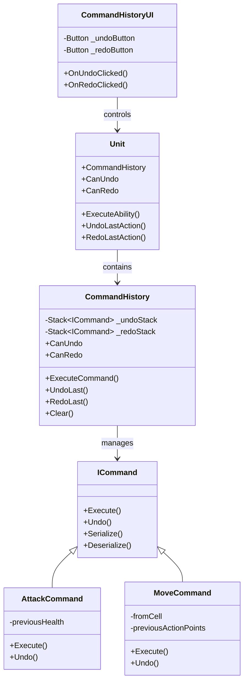

# Command Rollback System - Implementation Plan

## Overview

This plan focuses on implementing a robust command rollback (Undo/Redo) system for the existing Ability/Command architecture. The system will allow players to undo their actions and optionally redo them.

---

## Current Architecture Analysis

### Existing Interfaces

#### [`ICommand`](Assets/Tactics/Scripts/TbsfFork/External/tbsf-common/common/units/abilities/ICommand.cs:10)
```csharp
public interface ICommand
{
    Task Execute(IUnit unit, IGridController controller);      // Execute action
    Task Undo(IUnit unit, IGridController controller);         // Rollback action
    Dictionary<string, object> Serialize();                     // Serialize for network
    ICommand Deserialize(...);                                  // Deserialize
}
```

**Note**: The `ICommand` interface already includes `Undo` method support! The infrastructure for rollback exists but needs a manager to coordinate undo/redo operations.

---

## Implementation Plan

### Phase 1: Command History Manager

#### 1.1 Create CommandHistory Class
**File**: `Assets/Tactics/Scripts/TbsfFork/External/tbsf-common/common/controllers/CommandHistory.cs`

**Purpose**: Manage command execution history with undo/redo support

**Key Features**:
- Stack-based history management
- Support for undo and redo operations
- Clear history on new turn
- Optional history limit

**Implementation**:
```csharp
public class CommandHistory
{
    private Stack<ICommand> _undoStack = new Stack<ICommand>();
    private Stack<ICommand> _redoStack = new Stack<ICommand>();
    private int _maxHistorySize = 50;
    
    // Execute command and push to undo stack
    public async Task ExecuteCommand(ICommand command, IUnit unit, IGridController controller);
    
    // Undo last command
    public async Task UndoLast(IUnit unit, IGridController controller);
    
    // Redo last undone command
    public async Task RedoLast(IUnit unit, IGridController controller);
    
    // Clear all history (called at turn start)
    public void Clear();
    
    // Check if undo is available
    public bool CanUndo { get; }
    
    // Check if redo is available
    public bool CanRedo { get; }
}
```

---

### Phase 2: Integration with Unit

#### 2.1 Add CommandHistory to Unit
**File**: `Assets/Tactics/Scripts/TbsfFork/Scripts/units/Unit.cs`

**Changes**:
- Add `CommandHistory` field to Unit class
- Expose undo/redo methods
- Integrate with existing `ExecuteAbility` method

**New Properties**:
```csharp
public CommandHistory CommandHistory { get; private set; }
public bool CanUndo => CommandHistory.CanUndo;
public bool CanRedo => CommandHistory.CanRedo;
```

**New Methods**:
```csharp
public async Task UndoLastAction();
public async Task RedoLastAction();
```

---

### Phase 3: Update Existing Commands

#### 3.1 Review and Fix Existing Command Implementations

**Files to Review**:
- `AttackCommand.cs` - Verify Undo restores previous health
- `MoveCommand.cs` - Verify Undo restores previous position

**Requirements for Each Command**:
1. **State Snapshot**: Save all affected state before execution
2. **Idempotent Undo**: Undo must be safe to call multiple times
3. **Complete Restoration**: Undo must restore ALL changed state

**Example - AttackCommand**:
```csharp
public class AttackCommand : ICommand
{
    private IUnit _target;
    private float _damage;
    private float _previousHealth;  // Snapshot for undo
    
    public async Task Execute(IUnit unit, IGridController controller)
    {
        _previousHealth = _target.Health;  // Save state BEFORE modification
        _target.ModifyHealth(-_damage, unit);
    }
    
    public async Task Undo(IUnit unit, IGridController controller)
    {
        _target.Health = _previousHealth;  // Restore exact previous state
    }
}
```

---

### Phase 4: UI Integration

#### 4.1 Create Undo/Redo UI Buttons
**File**: `Assets/Tactics/Scripts/Runtime/UI/CommandHistoryUI.cs`

**UI Elements**:
- Undo button (enabled when CanUndo = true)
- Redo button (enabled when CanRedo = true)

**Implementation**:
```csharp
public class CommandHistoryUI : MonoBehaviour
{
    [SerializeField] private Button _undoButton;
    [SerializeField] private Button _redoButton;
    
    private Unit _currentUnit;
    
    private void Start()
    {
        _undoButton.onClick.AddListener(OnUndoClicked);
        _redoButton.onClick.AddListener(OnRedoClicked);
    }
    
    private async void OnUndoClicked()
    {
        if (_currentUnit != null)
        {
            await _currentUnit.UndoLastAction();
            UpdateButtonState();
        }
    }
    
    private async void OnRedoClicked()
    {
        if (_currentUnit != null)
        {
            await _currentUnit.RedoLastAction();
            UpdateButtonState();
        }
    }
    
    private void UpdateButtonState()
    {
        _undoButton.interactable = _currentUnit.CanUndo;
        _redoButton.interactable = _currentUnit.CanRedo;
    }
}
```

---

### Phase 5: Keyboard Shortcuts

#### 5.1 Add Keyboard Input Support
**File**: `Assets/Tactics/Scripts/Runtime/Input/InputManager.cs` (or existing input handler)

**Shortcuts**:
- `Ctrl+Z` - Undo
- `Ctrl+Y` - Redo

**Implementation**:
```csharp
private void Update()
{
    if (Input.GetKey(KeyCode.LeftControl) && Input.GetKeyDown(KeyCode.Z))
    {
        if (_currentUnit != null && _currentUnit.CanUndo)
        {
            await _currentUnit.UndoLastAction();
        }
    }
    
    if (Input.GetKey(KeyCode.LeftControl) && Input.GetKeyDown(KeyCode.Y))
    {
        if (_currentUnit != null && _currentUnit.CanRedo)
        {
            await _currentUnit.RedoLastAction();
        }
    }
}
```

---

## File Structure

```
Assets/Tactics/Scripts/TbsfFork/External/tbsf-common/common/controllers/
├── CommandHistory.cs              (NEW - Core rollback manager)

Assets/Tactics/Scripts/TbsfFork/Scripts/units/
├── Unit.cs                        (MODIFY - Add history field and methods)

Assets/Tactics/Scripts/Runtime/UI/
├── CommandHistoryUI.cs            (NEW - Undo/Redo buttons)

Assets/Tactics/Scripts/TbsfFork/External/tbsf-common/common/units/abilities/
├── AttackCommand.cs               (REVIEW - Verify Undo implementation)
└── MoveCommand.cs                 (REVIEW - Verify Undo implementation)
```

---

## Class Diagram



---

## Implementation Checklist

- [ ] **Phase 1**: Create `CommandHistory.cs`
  - [ ] Implement undo stack
  - [ ] Implement redo stack
  - [ ] Implement ExecuteCommand method
  - [ ] Implement UndoLast method
  - [ ] Implement RedoLast method
  - [ ] Implement Clear method
  - [ ] Add CanUndo/CanRedo properties

- [ ] **Phase 2**: Update `Unit.cs`
  - [ ] Add CommandHistory field
  - [ ] Add CanUndo/CanRedo properties
  - [ ] Add UndoLastAction method
  - [ ] Add RedoLastAction method
  - [ ] Initialize CommandHistory in Initialize()

- [ ] **Phase 3**: Review existing commands
  - [ ] Review AttackCommand - verify Undo saves/restores health
  - [ ] Review MoveCommand - verify Undo saves/restores position and action points
  - [ ] Fix any issues found

- [ ] **Phase 4**: Create UI
  - [ ] Create CommandHistoryUI.cs
  - [ ] Add Undo button to canvas
  - [ ] Add Redo button to canvas
  - [ ] Wire up button clicks
  - [ ] Update button states

- [ ] **Phase 5**: Add keyboard shortcuts
  - [ ] Add Ctrl+Z for undo
  - [ ] Add Ctrl+Y for redo

---

## Key Design Considerations

### 1. State Snapshot Timing
**Critical**: State must be saved BEFORE any modification in Execute()
```csharp
// CORRECT
public async Task Execute()
{
    _previousHealth = _target.Health;  // Save FIRST
    _target.Health -= damage;           // Then modify
}

// WRONG
public async Task Execute()
{
    _target.Health -= damage;           // Modified first!
    _previousHealth = _target.Health;   // Too late!
}
```

### 2. Undo Idempotency
Undo should be safe to call multiple times without side effects:
```csharp
public async Task Undo()
{
    // Direct restoration - safe to call multiple times
    _target.Health = _previousHealth;
}
```

### 3. Redo Stack Management
- Redo stack is cleared when a NEW command is executed
- Redo stack is populated when Undo is called
- This prevents branching timelines

### 4. Turn Boundaries
- Clear command history at the start of each turn
- Prevents undoing actions from previous turns
- Call `CommandHistory.Clear()` in `OnTurnStart()`

---

## Testing Scenarios

### Test 1: Basic Undo
1. Unit attacks enemy
2. Enemy health decreases
3. Player clicks Undo
4. Enemy health restores to previous value

### Test 2: Undo Then Redo
1. Unit attacks enemy
2. Player clicks Undo (health restored)
3. Player clicks Redo (health decreases again)

### Test 3: Undo Then New Action
1. Unit attacks enemy (Command A)
2. Player clicks Undo (Command A undone)
3. Unit moves (Command B)
4. Redo should NOT restore Command A (redo stack cleared)

### Test 4: Multiple Undos
1. Unit attacks (Command A)
2. Unit moves (Command B)
3. Unit attacks again (Command C)
4. Undo C → Undo B → Undo A (all actions reversed in order)

### Test 5: Turn Boundary
1. Unit takes multiple actions
2. Turn ends
3. New turn starts
4. Undo should not be available (history cleared)

---

## Next Steps

After this rollback system is implemented, the foundation will be ready for:
- New Ability types (Heal, AOE, Ranged Attack)
- Network serialization of command history
- Replay system (record and playback)
- AI decision rollback for simulation
